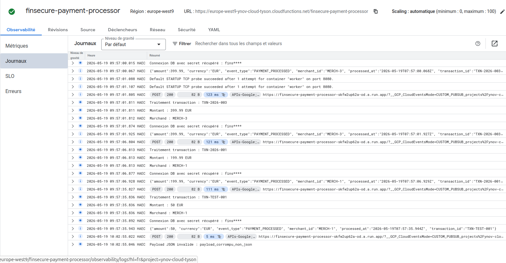
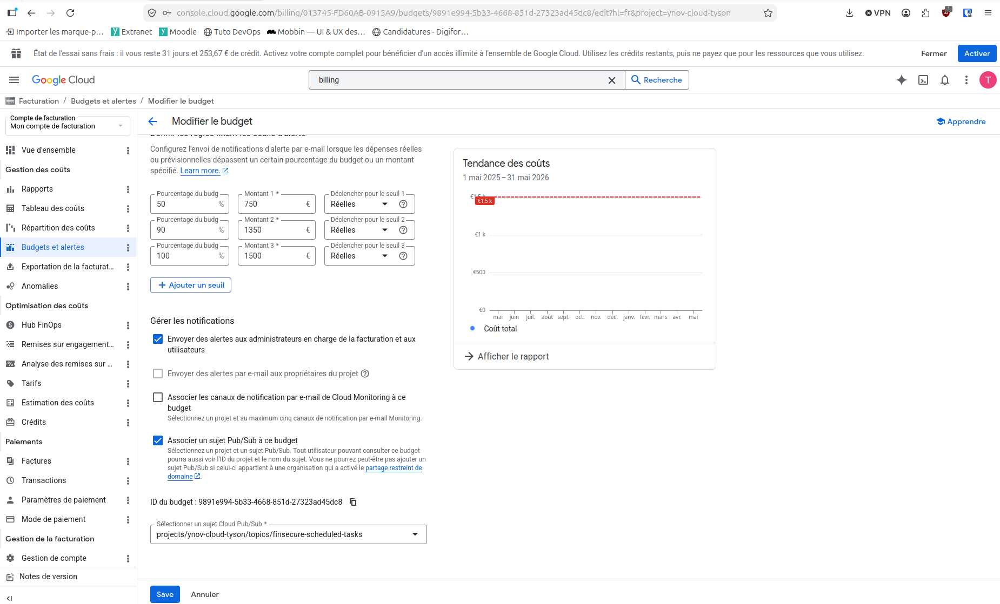

# FinSecure — Architecture Cloud DevSecOps (TP4)

Plateforme de paiement en ligne pour e-commerçants, traitant 50 000 transactions/jour sous réglementation DSP2.

Pipeline DevSecOps : build → scan Trivy → déploiement GKE.

---

## Architecture Event-Driven (Pub/Sub → Cloud Functions)

```
Banque partenaire
(webhook HTTP)
      │
      ▼
┌─────────────────────────────────────────────────────────────────┐
│                     Cloud Pub/Sub                               │
│                                                                 │
│   ┌──────────────────────────┐   ┌──────────────────────────┐  │
│   │  finsecure-payment-      │   │  finsecure-scheduled-    │  │
│   │  events                  │   │  tasks                   │  │
│   │  (topic)                 │   │  (topic)                 │  │
│   └────────────┬─────────────┘   └──────────────────────────┘  │
│                │                           ▲                    │
│   ┌────────────▼─────────────┐             │                    │
│   │  finsecure-payment-      │   ┌─────────┴──────────────┐    │
│   │  processor               │   │  Cloud Scheduler        │    │
│   │  (subscription)          │   │  - 23h00 quotidien      │    │
│   │  ack: 60s, rétention: 7j │   │  - 02h00 dim. (purge)   │    │
│   │  DLT après 5 tentatives  │   └────────────────────────┘    │
│   └────────────┬─────────────┘                                  │
└────────────────┼────────────────────────────────────────────────┘
                 │
                 ▼
┌────────────────────────────────────────────────────────────────┐
│              Cloud Functions Gen2 (nodejs20)                    │
│           finsecure-payment-processor                          │
│                                                                 │
│  1. Décoder le message Pub/Sub (base64)                        │
│  2. Valider les champs obligatoires                            │
│     (transaction_id, amount, currency, status, merchant_id)    │
│  3. Récupérer le secret DB depuis Secret Manager               │
│  4. Enregistrer la transaction (simulé)                        │
│  5. Émettre un log d'audit structuré dans Cloud Logging        │
│                                                                 │
│  ⚠️  JSON invalide → log + ACK (pas de throw → pas de retry)  │
│                                                                 │
│  max-instances: 10 | memory: 256Mi | timeout: 60s              │
└────────────────────────────────────────────────────────────────┘
                 │
                 ▼
┌────────────────────────────────────────────────────────────────┐
│              GCP Secret Manager                                 │
│  finsecure-db-password  │  finsecure-stripe-key               │
│  (accès via Workload Identity — sans clé JSON)                 │
└────────────────────────────────────────────────────────────────┘
```

---

## Architecture complète FinSecure

```
                    ┌─────────────────────────────────────────────┐
                    │           GitHub Actions CI/CD               │
                    │                                              │
                    │  test → build-push → security-scan → deploy │
                    │              (Trivy CRITICAL/HIGH)           │
                    │                                              │
                    │  Auth : Workload Identity Federation         │
                    │  (OIDC token — pas de clé JSON)              │
                    └───────────────┬─────────────────────────────┘
                                    │
                                    ▼
                    ┌─────────────────────────────────────────────┐
                    │         Artifact Registry                    │
                    │         tp4-app-registry (europe-west9)     │
                    └───────────────┬─────────────────────────────┘
                                    │
                                    ▼
┌───────────────────────────────────────────────────────────────────┐
│                      GKE Autopilot (tp3-cluster)                  │
│                         Namespace: default                        │
│                                                                   │
│  ┌─────────────────────────────────────────────────────────────┐ │
│  │                  finsecure-app (x2 replicas)                │ │
│  │                                                             │ │
│  │  Init container : fetch-secrets                            │ │
│  │  └── gcloud secrets versions access finsecure-db-password  │ │
│  │      → /secrets/db-password (emptyDir: Memory)             │ │
│  │                                                             │ │
│  │  Container : finsecure-api (Node.js 20)                    │ │
│  │  ├── GET /merchants  → Cache-Aside Redis (TTL 1h)          │ │
│  │  ├── POST /merchants → invalidateCache + DB write           │ │
│  │  └── GET /health     → liveness/readiness probe            │ │
│  │                                                             │ │
│  │  ServiceAccount: finsecure-app-ksa                         │ │
│  │  (Workload Identity → finsecure-github-sa)                 │ │
│  └────────────────────────────┬────────────────────────────────┘ │
└───────────────────────────────┼───────────────────────────────────┘
                                │
              ┌─────────────────┼─────────────────┐
              ▼                                   ▼
┌─────────────────────────┐         ┌─────────────────────────────┐
│    GCP Secret Manager   │         │  Cloud Memorystore Redis 7  │
│  finsecure-db-password  │         │  finsecure-cache            │
│  finsecure-stripe-key   │         │  10.241.113.147:6379        │
│  (audit via Cloud Logs) │         │  1 GB BASIC (tp3-app-vpc)   │
└─────────────────────────┘         └─────────────────────────────┘
```

---

## Pattern Cache-Aside (Redis)

```
Requête GET /merchants
        │
        ▼
  ┌─────────────┐    HIT     ┌─────────────────┐
  │ Redis Cache ├───────────►│ Réponse (~5ms)  │
  └──────┬──────┘            └─────────────────┘
         │ MISS
         ▼
  ┌─────────────┐            ┌─────────────────┐
  │  Cloud SQL  ├───────────►│ Réponse (~205ms)│
  │  (simulé)   │            └────────┬────────┘
  └─────────────┘                     │
                                      ▼
                             ┌─────────────────┐
                             │  Mise en cache  │
                             │  TTL : 1 heure  │
                             └─────────────────┘
```

---

## Captures d'écran

### Cloud Function — Logs de traitement


### Budget GCP — Seuils d'alerte


---

### Résultats benchmark

| Métrique | Sans cache (DB) | Avec cache (Redis) | Gain |
|---|---|---|---|
| Latence moyenne | 205 ms | 4.9 ms | **42x** |
| Latence p99 | 217 ms | 10.1 ms | **21x** |
| Requêtes/seconde | 48.7 | 1925.9 | **39x** |

---

## DevSecOps — Sécurité du pipeline

| Composant | Mécanisme |
|---|---|
| Secrets | GCP Secret Manager (chiffrement KMS, audit logs) |
| Auth CI/CD | Workload Identity Federation (OIDC, pas de clé JSON) |
| Scan images | Trivy (`CRITICAL,HIGH`, `--ignore-unfixed`, bloque le deploy) |
| Secrets pods | Init container + emptyDir Memory (jamais sur disque) |

---

## FinOps — Labels et budget

| Ressource | team | environment | feature | cost-center |
|---|---|---|---|---|
| Artifact Registry | infra | production | platform | engineering |
| Cloud Function | backend | production | payments | engineering |

Budget mensuel : **1 500 EUR** — alertes à 50%, 90%, 100% via Pub/Sub.

---

## Stack technique

| Composant | Technologie |
|---|---|
| Orchestration | GKE Autopilot (europe-west9) |
| Serverless | Cloud Functions Gen2 (nodejs20) |
| Messaging | Cloud Pub/Sub + Dead Letter Topic |
| Scheduler | Cloud Scheduler (cron Pub/Sub) |
| Cache | Cloud Memorystore Redis 7 (BASIC, 1 GB) |
| Secrets | GCP Secret Manager |
| Auth CI/CD | Workload Identity Federation (OIDC) |
| Scan sécurité | Trivy |
| Registry | Artifact Registry (europe-west9) |
| CI/CD | GitHub Actions |
