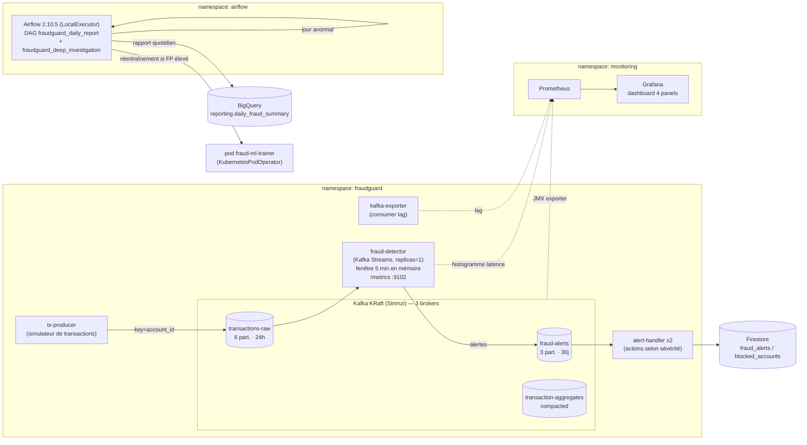

# FraudGuard — Détection de fraude temps réel (TP5)

Système de détection de fraude bancaire pour la néobanque **FraudGuard** (groupe Meridian),
déployé sur **Google Kubernetes Engine (Autopilot)**, région `europe-west9`, projet `ynov-cloud-tyson`.

Il combine deux plans complémentaires :

- **Temps réel** — un pipeline **Kafka (Strimzi)** + services **Node.js** qui détectent des
  patterns de fraude sur des fenêtres glissantes de 5 minutes et émettent des alertes.
- **Batch** — des **DAGs Apache Airflow** qui produisent les rapports réglementaires quotidiens
  et orchestrent le réentraînement ML.

Le tout est observé par **Prometheus + Grafana**.

---

## Architecture complète



> ⚠️ **Contrainte de quota** : le projet GCP est limité (`SSD_TOTAL_GB = 500`). Les trois
> parties (Kafka, Airflow, monitoring) ne tiennent pas simultanément sur le cluster. Elles
> sont donc déployées **séquentiellement** (on libère Airflow pour monter le monitoring, etc.).

---

## Partie 1 — Pipeline de détection temps réel

| Composant | Rôle |
|---|---|
| `fraud-detection/producer/transaction-producer.js` | Simule le flux transactionnel (légitime + rafales de micro-transactions frauduleuses). Clé Kafka = `account_id`. |
| `fraud-detection/streams/fraud-detector.js` | Moteur de détection. Fenêtre glissante 5 min **en mémoire**. Expose un histogramme de latence sur `:9102/metrics`. |
| `fraud-detection/alert-service/alert-handler.js` | Consomme `fraud-alerts`, écrit dans Firestore, agit selon la sévérité (blocage / limitation / audit). |

**3 patterns détectés** (tels qu'implémentés dans le code) :

| Pattern | `alert_type` | Sévérité | Condition |
|---|---|---|---|
| Micro-transactions répétées | `MICRO_TRANSACTION_PATTERN` | HIGH | > 10 tx < 2 € en 5 min |
| Vélocité élevée | `HIGH_VELOCITY` | CRITICAL | > 20 tx en 5 min |
| IP suspecte | `SUSPICIOUS_IP` | MEDIUM | IP ∈ liste de bots connue |

La cible centrale du scénario est la fraude par **micro-virements de 0,50 €** (compte mule
`ACC-9999`) → `MICRO_TRANSACTION_PATTERN`.

```bash
# Cluster Kafka + topics
kubectl apply -f kafka/fraudguard-cluster.yaml
kubectl wait kafka/fraudguard-kafka --for=condition=Ready --timeout=300s -n fraudguard
# Pipeline (Workload Identity requis pour alert-handler → Firestore)
kubectl apply -f k8s/fraudguard-deployments.yaml
```

---

## Partie 2 — Airflow avancé

`dags/fraud_daily_report.py` — rapport quotidien de fraude :

- **Dynamic Task Mapping** (`.expand()`) : une analyse par type d'alerte, en parallèle.
- **BigQueryInsertJobOperator** : chargement du rapport dans `reporting.daily_fraud_summary`.
- **KubernetesPodOperator** : réentraînement ML dans un pod dédié.
- **TriggerDagRunOperator** : déclenche `dags/fraud_deep_investigation.py` les jours anormaux.

```bash
# Image Airflow custom (base 2.10.5 + DAGs)
docker build -f airflow/Dockerfile -t .../fraudguard-airflow:2.10.5 .
helm install airflow apache-airflow/airflow -n airflow --version 1.16.0 -f airflow/airflow-values.yaml
kubectl apply -f airflow/postgres.yaml          # métadonnées (Postgres officiel)
kubectl apply -f airflow/pod-operator-rbac.yaml # KubernetesPodOperator → ns fraudguard
```

UI : `http://<LB-webserver>:8080` (admin / `FraudGuard2026!`).

---

## Partie 3 — Observabilité

```bash
helm install monitoring prometheus-community/kube-prometheus-stack \
  -n monitoring --create-namespace -f monitoring/monitoring-values.yaml
kubectl apply -f kafka/kafka-metrics-config.yaml   # ConfigMap JMX exporter
kubectl apply -f kafka/kafka-metrics.yaml          # PodMonitor brokers
kubectl apply -f k8s/fraud-detector-podmonitor.yaml
kubectl apply -f monitoring/fraud-alert-rules.yaml # 2 règles d'alerte
```

**Dashboard Grafana** (`monitoring/fraudguard-dashboard.json`, auto-importé) — 4 panels :

| Panel | Requête PromQL |
|---|---|
| 1. Débit transactions/s | `rate(kafka_server_brokertopicmetrics_messagesin_total{topic="transactions-raw"}[1m])` |
| 2. Alertes fraude/min | `rate(...{topic="fraud-alerts"}[5m]) * 60` |
| 3. Consumer lag | `kafka_consumergroup_lag{consumergroup="fraud-detection-group"}` |
| 4. Latence P99 | `histogram_quantile(0.99, sum(rate(fraud_detection_latency_seconds_bucket[5m])) by (le)) * 1000` |

**Alertes** : `FraudSpikeDetection` (> 10 alertes/min) et `DetectorLagCritical` (lag > 1000).

---

## Adaptations notables vs énoncé

Le matériel des cours suppose des versions plus anciennes ; le déploiement réel a nécessité :

- **Strimzi 1.0.0** : ZooKeeper supprimé → **KRaft + KafkaNodePool** ; API `v1` ; Kafka **4.1.0** ;
  `compression.type: producer` (KafkaJS ne décompresse pas snappy).
- **Airflow** : chart par défaut = 3.x → pinné **2.10.5** ; Postgres Bitnami du chart introuvable
  → **Postgres officiel** maison ; **LocalExecutor** (quota SSD : KubernetesExecutor créait un
  nœud par tâche) ; `workers.persistence` désactivé (sinon PVC logs 100 Gi non provisionnable).
- **kube-prometheus-stack** : node-exporter et composants control-plane désactivés
  (interdits / non scrapables sur GKE Autopilot).
- **DAG** : `KubernetesPodOperator` au lieu de `GKEStartPodOperator` (Airflow tourne in-cluster) ;
  `list()` sur le résultat du Dynamic Task Mapping (sérialisation JSON).

---

## Patterns de fraude — limites connues

Avec les seuils de l'énoncé (`VELOCITY_THRESHOLD = 20` tx / 5 min) face au trafic simulé
(~5 tx/s), tous les comptes légitimes dépassent le seuil de vélocité, et une alerte est émise
**à chaque message** (pas de déduplication) → beaucoup de faux positifs (~3700 alertes/10 min).
Comportement fidèle au code de l'énoncé ; en production il faudrait dédupliquer par compte/fenêtre,
remonter les seuils et externaliser l'état (Redis / Kafka Streams state store).
```

